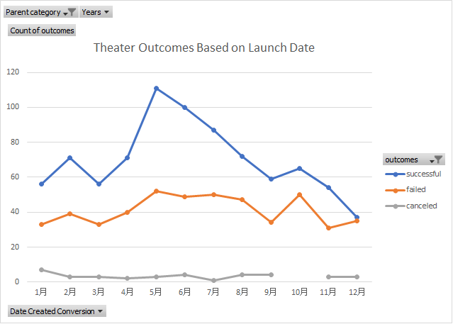
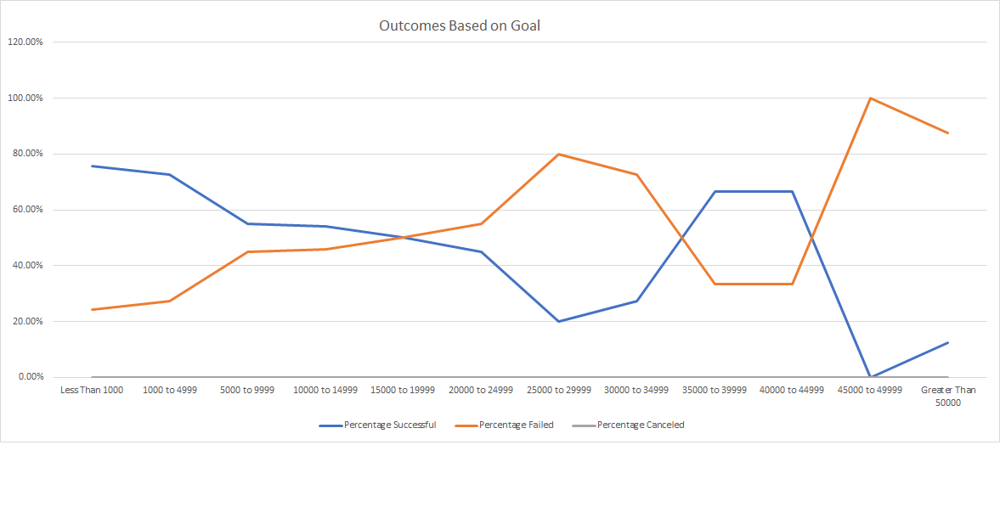

# Kickstarting with Excel

## Overview of Project

### Purpose
- Louise's play Fever came close to its fundraising goal in a short amount of time. Now, she wants to know how different campaigns fared in relation to their launch dates and their funding goals. 
- Using the Kickstarter dataset, I visualize campaign outcomes based on their launch dates and their funding goals, and provide this written report based on my analysis and the visualizations created here.

## Analysis and Challenges

### Analysis of Outcomes Based on Launch Date

- Here is the link to [Kickstarter_Challenge.xlsx](Kickstarter_Challenge.xlsx).
- pt B

### Analysis of Outcomes Based on Goals

- Here is the link to [Kickstarter_Challenge.xlsx](Kickstarter_Challenge.xlsx).
- pt B

### Challenges and Difficulties Encountered

- pt A
- pt B

## Results

- What are two conclusions you can draw about the Outcomes based on Launch Date?

- What can you conclude about the Outcomes based on Goals?

- What are some limitations of this dataset?

- What are some other possible tables and/or graphs that we could create?
